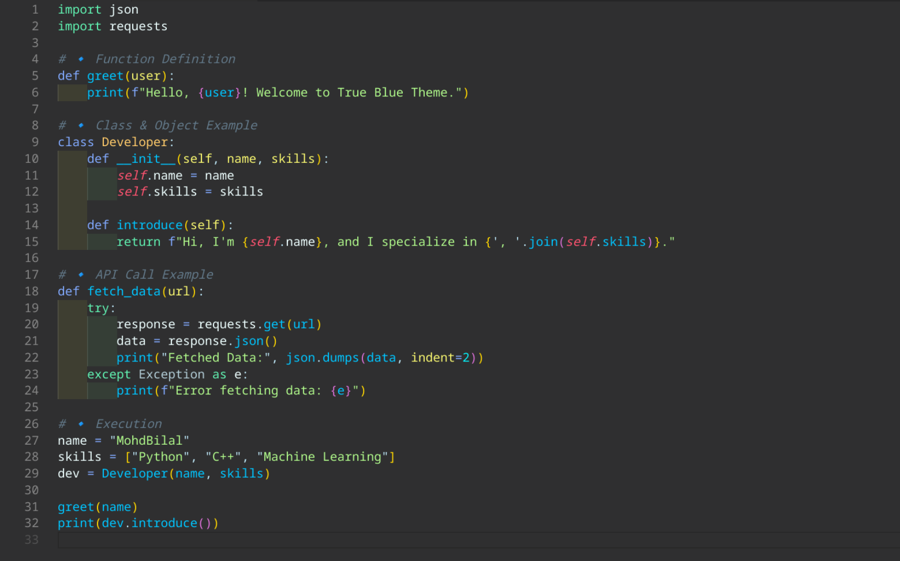

# **True Blue - VS Code Theme**

  
*A modern, clean, and eye-friendly VS Code theme.*

## **🌟 Features**
- Elegant and minimalistic color scheme
- Optimized for readability and reduced eye strain
- Perfect contrast for dark mode
- Well-balanced syntax highlighting for all major languages

## **📦 Installation**
### **From VS Code Marketplace**
1. Open **Visual Studio Code**
2. Go to **Extensions** (`Ctrl+Shift+X` / `Cmd+Shift+X`)
3. Search for `MohdBilal True Blue`
4. Click **Install** and activate the theme

### **Manual Installation**
1. Clone this repository:
   ```bash
   git clone https://github.com/mohdbilal/true-blue-vscode-theme.git
   ```
2. Open VS Code and go to `File > Preferences > Color Theme`
3. Select **MohdBilal True Blue** from the list

## **🎨 Screenshot**
### **Dark Mode**


## **⚙️ Customization**
Want to tweak the theme? You can customize it by editing the `package.json` in the repo.

## **🚀 Contributing**
Feel free to **open an issue** or submit a **pull request** if you have suggestions or improvements!

## **📜 License**
This theme is released under the **MIT License**.

---
_Enjoy coding with True Blue!_ ✨

